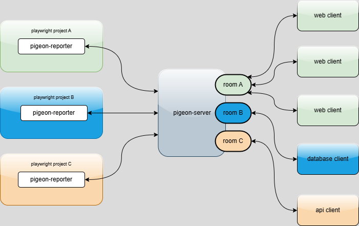

# pigeon-server

Pigeon Server is a simple WebSocket server that acts as a real-time bridge between [pigeon-reporter](https://www.npmjs.com/package/pigeon-reporter) (used in Playwright projects) and any clients you can built on top of it. It lets you broadcast test events live so clients can visualize, store, or process results as they happen.

## Installation

Install with npm:

```bash
npm install pigeon-server
```

## Environment Setup

By default, the server runs on port `3004`. To use a different port, set the environment variable before starting the server:

```bash
export PIGEON_SERVER_PORT=4000
```


## How it works

- Each Playwright project using pigeon-reporter sends test events to the server and each messages contains a `projectId`.
- The server broadcasts these events to all clients subscribed to that project's room.
- Clients (such as dashboards or databases) connect and subscribe to a project room to receive live updates (see more about [socket.io rooms](https://socket.io/docs/v3/rooms/))



This setup allows you to:

- Visualize test results in real time
- Store results in a database
- Build custom integrations for your test events

## Usage

Start the server with npx:

```bash
npx pigeon-server
```

You should see:

```
Pigeon server listens at http://localhost:4000
```

If you want the server to be accessible over your network, make sure your firewall and network settings allow incoming connections on the chosen port.

Each message that pigeon-server broadcasts is with this structure:

```
type EmitMessage = {
    projectId: string;
    eventType: string;
    target?: string;
    status?: string;
    test?: string;
    error?: string;
    errorLocation?: {
        file: string;
        line: number;
        column: number };
    percentage?: number;
    duration?: number;
    location?: string;
    retry?: number;
    screenshotBase64?: string;
    workerIndex?: number;
    totalTests?: number;
    startTime?: Date;
    testId?: string;
}
```
and most of the data depends of the `eventType` property that can be one of:
```
    TEST_RUN_STARTED = 'test run started',
    TEST_RUN_COMPLETED = 'test run completed',
    TEST_STARTED = 'test started',
    TEST_COMPLETED = 'test completed',
```

Examples:

- when `eventType` is `TEST_RUN_STARTED` the message looks like:

```
{
  projectId: 'demo_navigation',
  eventType: 'test run started',
  percentage: 0,
  totalTests: 36
}
```

but when `eventType` is `TEST_COMPLETED` the message looks like:

```
{
  projectId: 'demo_navigation',
  status: 'failed',
  test: 'url should match when navigating to accuweather',
  eventType: 'test completed',
  percentage: 30.56,
  duration: 42537,
  retry: 0,
  screenshotBase64: 'iVBORw0KGgoAAAANSUhEUgAABQAAAALQCAIAAABAH0oBAAAAAXNSR0IArs4c6QAAEKVJREFUeJzt18ENwCAQwLDS/Xc+=...
  ',
  workerIndex: 5,
  startTime: '2025-07-03T10:49:12.370Z',
  target: 'chromium',
  testId: '59838c6127c87d7e02ce-a0ddb7c8f6b3d06d78b5',
  error: 'Error: page.goto: net::ERR_HTTP2_PROTOCOL_ERROR at https://accuweather.com/\n' +
    'Call log:\n' +
    '\x1B[2m  - navigating to "https://accuweather.com/", waiting until "load"\x1B[22m\n',
  errorLocation: {
    file: 'pigeon-test\\tests\\shouldMatchUrl.spec.ts',
    line: 40,
    column: 14
  }
}
```

The server prints out the each message all the time so when you are building something on top of it, you can always check the message strucure in console.

## Author

Filip Kantardjioski

[https://github.com/kantarogit](https://github.com/kantarogit)

## Contributing

1. Fork the repository [pigeon-server](https://www.npmjs.com/package/pigeon-server)
2. Create your feature branch (`git checkout -b feature/amazing-feature`)
3. Commit your changes (`git commit -m 'Add some amazing feature'`)
4. Push to the branch (`git push origin feature/amazing-feature`)
5. Open a Pull Request

## License

This project is licensed under the ISC License.


